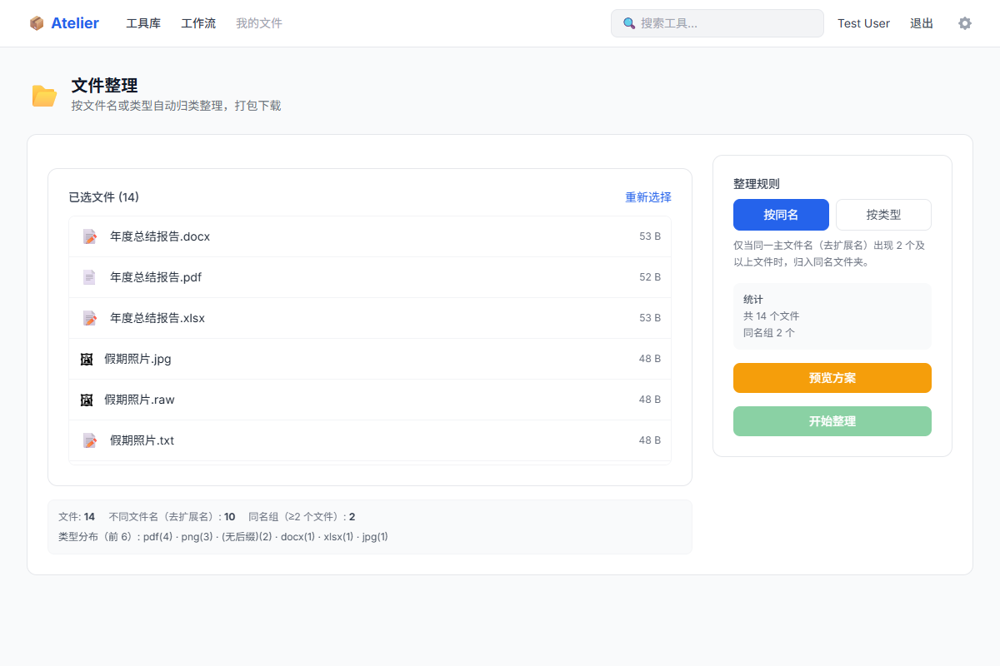
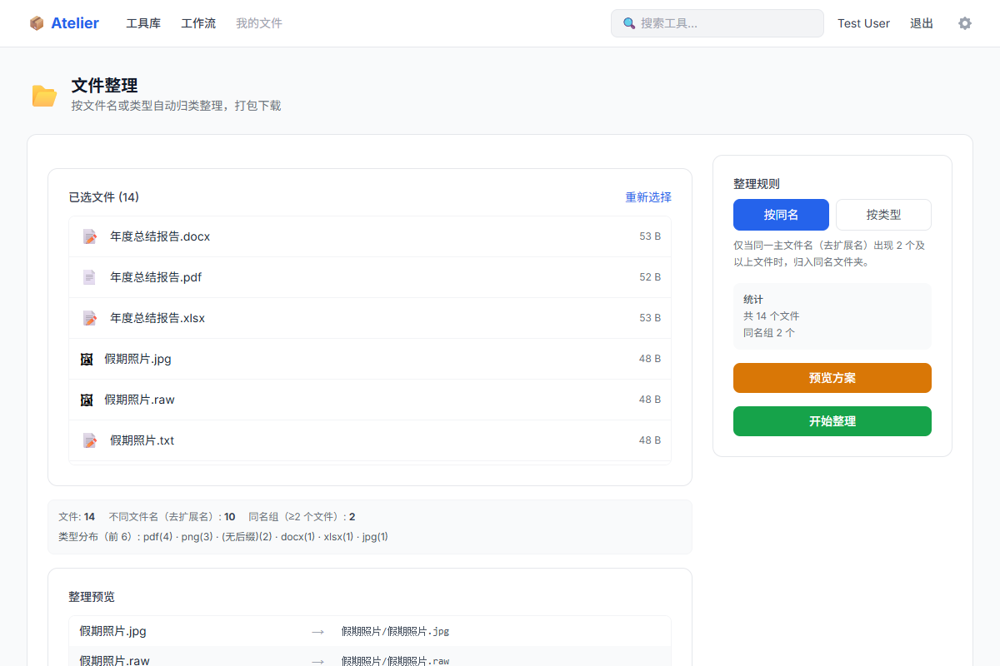
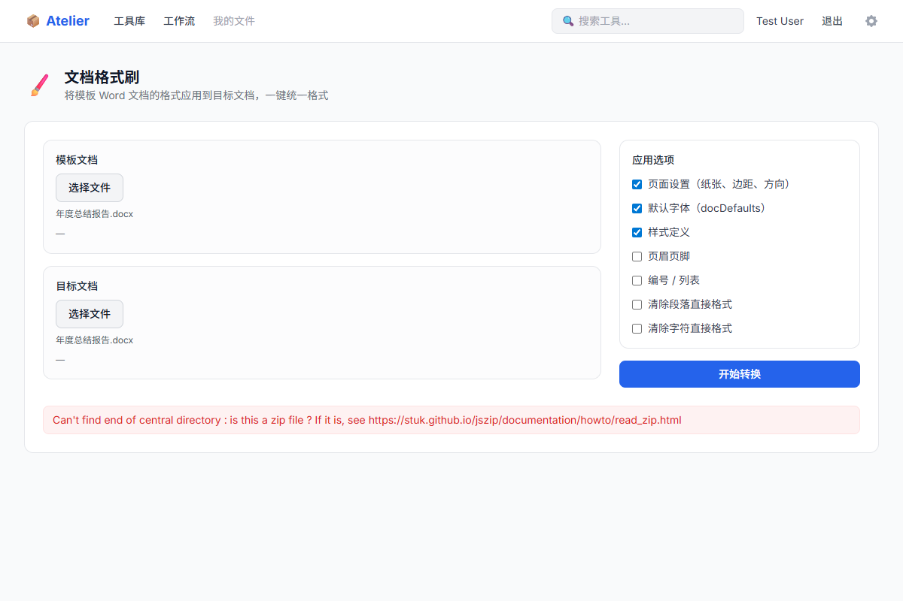

# Atelier

> 媒体工具聚合平台 — 为电商运营、自媒体创作者、中小企业设计团队打造

Atelier 聚合互联网上优秀的媒体处理工具，提供统一的中文化体验和增值功能，包括工作流串联、批量处理和文件管理。

## 特性

- **浏览器端处理** — 图片裁剪、压缩、格式转换等轻量任务直接在浏览器完成，零服务器成本
- **批量处理** — 多文件上传 → 预览确认 → 全量执行 → 结果审查 → 一键下载
- **工作流引擎** — 将多个工具串成流水线，预设模板一键复用
- **AI 增强** — AI 去背景、AI 生图、AI 文案、AI 场景合成，支持自有 Key 和平台 Key
- **插件化架构** — 每个工具独立为 npm 包，通过 Manifest 声明能力，快速集成

## 已有工具

### 图片工具（浏览器端）

| 工具 | 说明 |
|------|------|
| 图片裁剪 | 自由裁剪、按比例裁剪、内置 15 个平台预设尺寸（淘宝/京东/抖音/小红书/B站等） |
| 图片压缩 | 质量控制、体积限制、尺寸限制 |
| 格式转换 | JPEG / PNG / WebP 互转 |
| 调整尺寸 | 指定像素/百分比缩放，适应/填充模式，批量处理 |
| 批量水印 | 文字水印、图片水印、平铺防盗模式，支持位置/透明度/旋转 |
| 多平台导出 | 一键导出淘宝、京东、拼多多、抖音等平台尺寸 ZIP |

### AI 工具（服务端）

| 工具 | 说明 |
|------|------|
| AI 去背景 | 基于 remove.bg API，一键去除图片背景 |
| AI 商品图生成 | 输入商品描述，GPT-Image-1 自动生成高质量商品图 |
| AI 电商文案 | 输入商品信息，GPT-4o 一键生成淘宝/抖音/小红书/拼多多风格文案 |
| AI 场景合成 | 抠图 + AI 生成背景，6 个预设场景模板，快速合成电商场景图 |

### 其他工具

| 工具 | 说明 |
|------|------|
| 文件整理 | 按文件名或类型自动归类整理，打包下载 |
| 文档格式刷 | 将模板 Word 文档的格式应用到目标文档，一键统一格式 |

## 工作流模板

预设工作流一键复用：

| 模板 | 流程 |
|------|------|
| 电商商品图批处理 | AI 抠图 → 多平台尺寸导出 |
| AI 商品图一站式 | AI 抠图 → 场景合成 → 多平台导出 |
| 多平台尺寸导出 | 一张图生成全部电商/社媒平台尺寸 |
| 自媒体封面制作 | 16:9 裁剪 → WebP 转换 |
| 图片批量压缩 | 压缩 → WebP 转换 |
| AI 批量文案生成 | 多商品一键出文案 |

## 演示 (Demos)

### 1. 文件整理工具
自动按照文件名或文件类型对散乱的文件进行归类，并打包下载：

<div style="display: flex; flex-direction: column; gap: 10px;">
  
  
</div>

### 2. 文档格式刷
一键将目标 Word 文档的页面设置、字体、段落格式、页眉页脚统一为模板文档的样式：



## 技术栈

| 层 | 技术 |
|----|------|
| 前端 | Next.js 14 (App Router) · React 18 · Tailwind CSS |
| 状态管理 | Zustand |
| API | tRPC (端到端类型安全) |
| 数据库 | SQLite (开发) / PostgreSQL (生产) · Prisma ORM |
| 客户端处理 | Canvas API · browser-image-compression |
| AI 集成 | OpenAI API (GPT-4o / GPT-Image-1) · remove.bg API |
| Monorepo | pnpm workspaces · Turborepo |

## 项目结构

```
atelier/
├── packages/
│   ├── tools/                  # 工具插件
│   │   ├── image-crop/         # 图片裁剪
│   │   ├── image-compress/     # 图片压缩
│   │   ├── image-format/       # 格式转换
│   │   ├── image-resize/       # 调整尺寸
│   │   ├── image-watermark/    # 批量水印
│   │   ├── image-platform-export/  # 多平台导出
│   │   ├── ai-remove-bg/       # AI 去背景
│   │   ├── ai-image-gen/       # AI 商品图生成
│   │   ├── ai-copy-gen/        # AI 电商文案
│   │   ├── ai-scene-compose/   # AI 场景合成
│   │   ├── doc-format-brush/   # 文档格式刷
│   │   └── file-organizer/     # 文件整理
│   ├── engines/                # 共享处理引擎
│   │   └── engine-image/       # 图片处理引擎（Canvas API）
│   ├── platform/
│   │   └── web/                # Next.js Web 平台（tRPC + Prisma）
│   ├── shared/
│   │   └── types/              # 共享类型定义 + 平台预设尺寸
│   └── ui-kit/                 # 通用 UI 组件
├── docs/                       # 设计文档与里程碑计划
├── pnpm-workspace.yaml
├── turbo.json
└── package.json
```

## 快速开始

### 环境要求

- Node.js >= 18
- pnpm >= 9

### 安装与运行

```bash
# 克隆仓库
git clone https://github.com/L-aruan/atelier.git
cd atelier

# 安装依赖
pnpm install

# 配置环境变量（默认 SQLite，开箱即用）
cp packages/platform/web/.env.example packages/platform/web/.env

# 初始化数据库 + 生成 Prisma 客户端
pnpm --filter @atelier/web exec prisma db push

# 启动开发服务器
pnpm dev
```

访问 http://localhost:3200 即可使用。

### 常用命令

```bash
pnpm dev          # 启动开发服务器
pnpm build        # 构建所有包
pnpm lint         # 代码检查
pnpm clean        # 清理构建产物
```

## 添加新工具

每个工具是独立的 npm 包，遵循统一接口：

1. 在 `packages/tools/` 下创建目录
2. 编写 `manifest.json` 声明工具能力（输入类型、运行环境、分类等）
3. 实现 `processor.ts`（处理逻辑）和 React 组件（UI）
4. 在 `packages/platform/web/src/lib/register-tools.ts` 中注册

```typescript
// 工具需实现的标准接口
interface AtelierTool {
  manifest: ToolManifest
  Component: React.FC<ToolProps>
  process(input: FileInput, options: ToolOptions): Promise<FileOutput>
}
```

### AI 工具开发要点

AI 工具在 manifest 中声明 `aiProvider` 和 `customLayout`，ToolPageShell 会自动注入 `apiKey` 和 `callApi`：

```json
{
  "category": "ai",
  "aiProvider": "openai",
  "customLayout": true,
  "runtime": { "client": false, "server": true }
}
```

## API Key 配置

AI 工具支持混合 Key 模式：

- **自有 Key**：在 设置 → API Key 管理 中添加（支持 remove.bg、OpenAI、OpenRouter、Stability AI）
- **平台 Key**：服务端通过环境变量配置 fallback key，零配置使用

当前支持的 AI 服务：

| Provider | 用途 | 环境变量 |
|----------|------|----------|
| OpenAI | 文案生成 (GPT-4o)、图片生成 (GPT-Image-1) | `OPENAI_API_KEY` |
| remove.bg | AI 抠图 | `REMOVE_BG_API_KEY` |

## License

MIT
